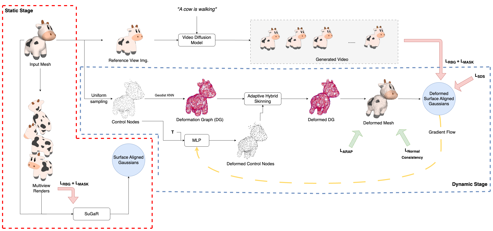

# mesh-to-4d

## Codebase TODOS

1. Repository should only contain code that will be plugged into threestudio.
3. Providing an environment.yml for plug-and-play.
2. Cleanup unused parameters, configurations from DreamMesh4D.